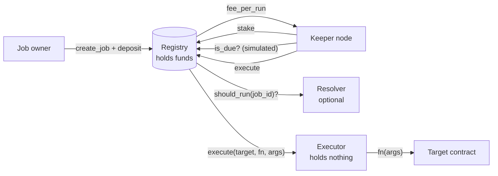

# SoroCron

**Decentralized automation for Soroban smart contracts on Stellar.**

[](https://github.com/sorocon-labs/sorocron/actions/workflows/ci.yml)


Soroban contracts can't run themselves: nothing happens on-chain until someone sends a transaction. Every protocol that needs recurring or conditional actions (vesting releases, liquidations, rebalancing, subscription charges, DAO execution, keeping state from being archived) ends up running its own private cron server, which becomes a centralized single point of failure.

SoroCron replaces those servers with an open network:

- **Job owners** schedule contract calls and prepay a fee per run in any SEP-41 token.
- **Keepers** stake tokens, watch for due jobs, execute them, and earn the fee.
- **Resolvers** let a job run only when an on-chain condition holds.
- **TTL Guardian** keeps any contract from being archived, as an ordinary scheduled job.

## Features

| | |
|---|---|
| ⏱️ **Interval scheduling** | Start times, max runs, catch-up-safe (missed runs never fire back-to-back) |
| 🧠 **Conditional jobs** | Resolver contracts decide `should_run(job_id)`; broken resolvers block instead of breaking keepers |
| 🛡️ **Fund-less executor** | Targets are called by a contract that owns nothing, so jobs can never borrow the registry's authority |
| 🧊 **State archival protection** | TTL Guardian extends a contract's instance and code TTL on schedule |
| 🔒 **Keeper staking** | Minimum stake, unbonding period, per-keeper execution stats |
| ⏸️ **Owner controls** | Fund, pause, resume or cancel jobs; refunds always available |
| 🚨 **Safe administration** | Emergency pause that never blocks exits; two-step admin handover |
| 🤖 **Reference keeper** | TypeScript keeper node with testnet deploy and end-to-end demo |

## Live on testnet (v0.2.0)

| Contract | Address |
|---|---|
| Registry | [`CDOAY46V2REWSINTZINUKTYELO5FYVEOCFWEKVMGH4BUJPSTRZTRGQ5W`](https://stellar.expert/explorer/testnet/contract/CDOAY46V2REWSINTZINUKTYELO5FYVEOCFWEKVMGH4BUJPSTRZTRGQ5W) |
| Executor | [`CBRQANLQBDWDUM5GRQBP7T3VZBOXG6EZEKNRNYMXTFAYWSDSJL6PPAFA`](https://stellar.expert/explorer/testnet/contract/CBRQANLQBDWDUM5GRQBP7T3VZBOXG6EZEKNRNYMXTFAYWSDSJL6PPAFA) |
| TTL Guardian | [`CB3KQFXKCL4SEBQTDGCZHJLBX365ORTHQY724SCETVS2GYZCXPGGLE73`](https://stellar.expert/explorer/testnet/contract/CB3KQFXKCL4SEBQTDGCZHJLBX365ORTHQY724SCETVS2GYZCXPGGLE73) |
| Example target (counter) | [`CDAJHPUZX55DPNTABY5OTXJYK27XWS6V744BLS5LPWMOTTI7LERGJWU2`](https://stellar.expert/explorer/testnet/contract/CDAJHPUZX55DPNTABY5OTXJYK27XWS6V744BLS5LPWMOTTI7LERGJWU2) |
| Example resolver (flag) | [`CDYKTISS6TCWDPE2NJ5YVD3FJU6ULCZXLMSQE32XQTIICMCVDDIGHWXO`](https://stellar.expert/explorer/testnet/contract/CDYKTISS6TCWDPE2NJ5YVD3FJU6ULCZXLMSQE32XQTIICMCVDDIGHWXO) |

Fee and stake token: native XLM. Min keeper stake: 1 XLM. Unbonding: 1 hour.

On-chain proof:
[scheduled job executed](https://stellar.expert/explorer/testnet/tx/306d0f2fe8df1d19114d2a3a8a9eed3c06257151bf8fa2efaa09a2a41d3a5d06) ·
[TTL Guardian job executed](https://stellar.expert/explorer/testnet/tx/4c153924f97346e98eb4957608d7fbad9f5fcd95ef1e124053be1857245ade6a) ·
[keeper node executing autonomously](https://stellar.expert/explorer/testnet/tx/3c8d106d827518a4f9ec5fe355a2c4f92597ea12b86b509ebeed19e4ddbaf377)

Stellar resets testnet periodically; the current addresses are always in [`deployments/testnet.json`](deployments/testnet.json).

## How it works



1. An owner calls `create_job` with a target contract, function, arguments, interval and fee per run, and deposits enough of the fee token to cover some runs.
2. Keepers poll `is_due(job_id)`, which is a free simulation.
3. The first keeper to land `execute` makes the registry check the schedule and resolver, advance the job, call the target **through the executor**, and pay that keeper `fee_per_run`.

Why the executor? Inside a called contract, the caller's `require_auth()` passes automatically. If the registry called targets itself, a malicious job could spend the registry's escrowed funds. The executor owns nothing, so there's nothing to steal. [Read the security model →](docs/security.md)

### Protecting a contract from archival

```text
target:   <TTL Guardian>
function: extend
args:     [<your contract>, 5_184_000 (threshold), 7_776_000 (extend_to)]
interval: 86400
```

Keepers check daily and extend your contract's instance and code TTL whenever it drops below the threshold. [Details and limitations →](docs/architecture.md#ttl-guardian)

## Quick start

**Requirements:** [Rust](https://rustup.rs) (stable) and Node.js 20+.

```bash
rustup target add wasm32v1-none

# Contracts: test and build
cargo test
cargo build --release --target wasm32v1-none

# Keeper bot
cd keeper-bot
npm install

# Deploy your own copy to testnet (generates and funds a key in keeper-bot/.env)
npm run deploy:testnet

# Stake, schedule counter.increment(1) every 30s and a daily TTL Guardian job, run both once
npm run demo

# Run a keeper that executes due jobs until stopped (Ctrl+C)
npm run keeper
```

No Stellar CLI is needed; the scripts use `@stellar/stellar-sdk`. With the [Stellar CLI](https://developers.stellar.org/docs/tools/cli) you can call the registry directly:

```bash
stellar contract invoke --id CDOAY46V2REWSINTZINUKTYELO5FYVEOCFWEKVMGH4BUJPSTRZTRGQ5W --network testnet -- job_count
```

A `stellar contract invoke` example for every registry function is in [docs/cli.md](docs/cli.md).

## Contract API

### Registry

| Function | Who | Description |
|---|---|---|
| `create_job(owner, params, deposit) -> u64` | anyone | Register a job and escrow its fee deposit |
| `fund_job(from, job_id, amount) -> i128` | anyone | Top up a job's balance |
| `set_job_active(job_id, active)` | job owner | Pause or resume a job |
| `withdraw_job_balance(job_id, amount) -> i128` | job owner | Withdraw part of a job's balance without cancelling it |
| `cancel_job(job_id) -> i128` | job owner | Delete the job and refund the balance |
| `execute(keeper, job_id)` | staked keeper | Run a due job and collect `fee_per_run` |
| `stake(keeper, amount) -> i128` | anyone | Become a keeper / add stake |
| `begin_unbonding(keeper) -> u64` | keeper | Stop executing; start the withdrawal timer |
| `withdraw_stake(keeper) -> i128` | keeper | Withdraw stake after unbonding |
| `set_executor(executor)` | admin, once | Connect the executor contract |
| `propose_admin(new_admin)` / `cancel_admin_proposal()` / `accept_admin()` | admin / admin / proposed admin | Two-step admin handover |
| `set_paused(bool)` / `set_min_stake(i128)` | admin | Emergency pause / keeper requirements |
| `set_min_interval(u64)` / `set_max_args(u32)` | admin | Minimum job interval / maximum `args` length (`0` = no limit) |
| `is_due`, `get_job`, `get_jobs(start, limit)`, `jobs_by_owner`, `get_keeper`, `job_count`, `config`, `pending_admin` | anyone | Read-only views |

`JobParams`: `target`, `function`, `args`, `interval` (seconds), `start_at` (unix time, `0` = now), `fee_per_run`, `max_runs` (`0` = unlimited), `end_at` (unix time, `0` = never), `resolver` (optional).

A resolver is any contract exposing `should_run(job_id: u64) -> bool`.

### Executor

| Function | Who | Description |
|---|---|---|
| `execute(target, function, args) -> Val` | registry only | Perform a job's target call |
| `registry() -> Address` | anyone | The registry this executor serves |

### TTL Guardian

| Function | Who | Description |
|---|---|---|
| `extend(contract, threshold, extend_to) -> u32` | anyone | Extend `contract`'s instance and code TTL if below `threshold` |
| `extend_many(contracts, threshold, extend_to) -> Vec<u32>` | anyone | Same, for up to 20 contracts in one call |

All error codes are listed in [docs/architecture.md](docs/architecture.md#error-codes).

## Repository layout

```
contracts/
  registry/                core contract: jobs, scheduling, fees, keeper staking, admin
  executor/                fund-less contract that performs target calls
  ttl-guardian/            scheduled TTL extension against state archival
  examples/counter/        minimal job target
  examples/flag-resolver/  minimal resolver
keeper-bot/                reference keeper node + deploy/demo scripts (TypeScript)
deployments/               deployed contract addresses per network
docs/                      architecture and security model
```

## Project status

- 5 contracts, 44 unit and integration tests (`cargo test`)
- CI: formatting, clippy with warnings as errors, tests, WASM build with a size budget, keeper typecheck
- Deployed and exercised on testnet
- **Not audited.** See [Security](#security).

## Roadmap

- [x] **M1: Core.** Registry, interval scheduling, resolvers, keeper staking and unbonding, pause, reference keeper, testnet deployment
- [x] **M2: Hardening.** Fund-less executor, two-step admin, per-job pause
- [x] **M3: State archival.** TTL Guardian
- [ ] **M4: Keeper economics.** Rotating execution windows, slashing, protocol fee, failure tracking, batch execution
- [ ] **M5: Developer experience.** Typed TypeScript SDK, CLI, web dashboard, integrations (vesting, DCA, oracle-triggered actions, subscriptions)
- [ ] **M6: Mainnet.** Invariant/fuzz testing, threat model, external audit

See the [changelog](CHANGELOG.md) for what shipped in each release. Open work is tracked in [issues](https://github.com/sorocon-labs/sorocron/issues), labelled by area and complexity.

## Contributing

Contributions are welcome, including through [Drips Wave](https://www.drips.network/wave). Read [CONTRIBUTING.md](CONTRIBUTING.md), pick an issue labelled `good first issue` or `complexity: *`, and comment to get assigned. Please follow the [code of conduct](CODE_OF_CONDUCT.md).

## Security

SoroCron is **unaudited**. Don't use it with real funds. Report vulnerabilities privately as described in [SECURITY.md](SECURITY.md).

## License

[MIT](LICENSE)
