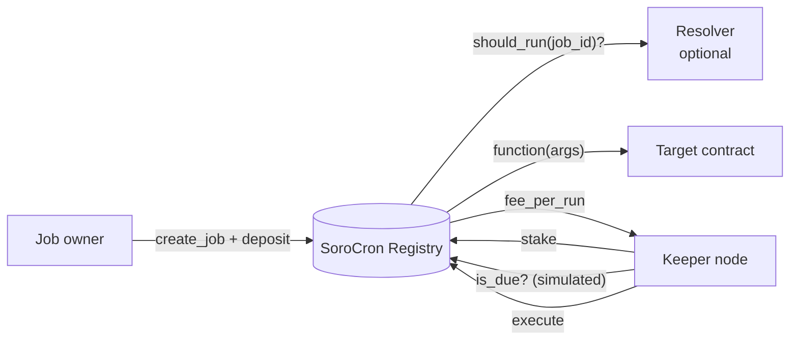

# SoroCron

**Decentralized automation for Soroban smart contracts on Stellar.**

[](https://github.com/sorocon-labs/sorocron/actions/workflows/ci.yml)


Soroban contracts can't run themselves: nothing happens on-chain until someone sends a transaction. Every protocol that needs recurring or conditional actions (vesting releases, liquidations, rebalancing, subscription charges, DAO execution) ends up running its own private cron server, which becomes a centralized single point of failure.

SoroCron replaces those servers with an open network. **Job owners** register calls to run on a schedule and prepay a fee per run. **Keepers** stake tokens, watch for due jobs, execute them, and earn the fee. **Resolvers** let a job run only when an on-chain condition holds.

## Live on testnet

| Contract | Address |
|---|---|
| Registry | [`CDXUSYDL3SQRHRW3MK7AXC5MVYZWL5V4BDNGL43HOQWUNTLT2UHNPYDF`](https://stellar.expert/explorer/testnet/contract/CDXUSYDL3SQRHRW3MK7AXC5MVYZWL5V4BDNGL43HOQWUNTLT2UHNPYDF) |
| Example target (counter) | [`CDZKEUW5OYOLUQWAM6CFL3PI6TGXOEACAJJDZXHTUQQ3AMLG6NJVBKCM`](https://stellar.expert/explorer/testnet/contract/CDZKEUW5OYOLUQWAM6CFL3PI6TGXOEACAJJDZXHTUQQ3AMLG6NJVBKCM) |
| Example resolver (flag) | [`CAZTFQE4UY5QJUH23FY3N2DZIVQF5SYJ2TVRH2XT2VDQHZBBH3B3JTYE`](https://stellar.expert/explorer/testnet/contract/CAZTFQE4UY5QJUH23FY3N2DZIVQF5SYJ2TVRH2XT2VDQHZBBH3B3JTYE) |

Fee and stake token: native XLM. Min keeper stake: 1 XLM. Unbonding: 1 hour.
First automated execution: [transaction](https://stellar.expert/explorer/testnet/tx/4ce64a0a790bd4dabc717803d1cda59deddefd43ad1fbe2ee7e279de111f9b2e).
Stellar resets testnet periodically; the current addresses are always in [`deployments/testnet.json`](deployments/testnet.json).

## How it works



1. An owner calls `create_job` with a target contract, function, arguments, interval and fee per run, and deposits enough of the fee token to cover some runs.
2. Keepers poll `is_due(job_id)`. This is a free simulation.
3. The first keeper to land `execute` makes the registry call the target, advance the schedule and pay that keeper `fee_per_run`.
4. If the job has a resolver, it only runs when `resolver.should_run(job_id)` returns `true`.

More detail: [architecture](docs/architecture.md) · [security model](docs/security.md)

## Quick start

**Requirements:** [Rust](https://rustup.rs) (stable) and Node.js 20+.

```bash
rustup target add wasm32v1-none

# Contracts: test and build
cargo test
cargo build --release --target wasm32v1-none

# Keeper bot: install
cd keeper-bot
npm install

# Deploy your own copy to testnet (generates and funds a key in keeper-bot/.env)
npm run deploy:testnet

# Stake, schedule counter.increment(1) every 30s, execute it once
npm run demo

# Run a keeper that executes due jobs forever (Ctrl+C to stop)
npm run keeper
```

No Stellar CLI is needed; the scripts use `@stellar/stellar-sdk`. If you have the [Stellar CLI](https://developers.stellar.org/docs/tools/cli), you can call the registry directly:

```bash
stellar contract invoke --id CDXUSYDL3SQRHRW3MK7AXC5MVYZWL5V4BDNGL43HOQWUNTLT2UHNPYDF --network testnet -- job_count
```

## Contract API

| Function | Who | Description |
|---|---|---|
| `create_job(owner, params, deposit) -> u64` | anyone | Register a job and escrow its fee deposit |
| `fund_job(from, job_id, amount) -> i128` | anyone | Top up a job's balance |
| `cancel_job(job_id) -> i128` | job owner | Delete the job and refund the balance |
| `execute(keeper, job_id)` | staked keeper | Run a due job and collect `fee_per_run` |
| `stake(keeper, amount) -> i128` | anyone | Become a keeper / add stake |
| `begin_unbonding(keeper) -> u64` | keeper | Stop executing; start the withdrawal timer |
| `withdraw_stake(keeper) -> i128` | keeper | Withdraw stake after unbonding |
| `set_paused(bool)` / `set_min_stake(i128)` | admin | Emergency pause / keeper requirements |
| `is_due`, `get_job`, `get_keeper`, `job_count`, `config` | anyone | Read-only views |

`JobParams`: `target`, `function`, `args`, `interval` (seconds), `start_at` (unix time, `0` = now), `fee_per_run`, `max_runs` (`0` = unlimited), `resolver` (optional).

A resolver is any contract exposing `should_run(job_id: u64) -> bool`.

## Repository layout

```
contracts/
  registry/              core contract: jobs, execution, keeper staking
  examples/counter/      minimal job target
  examples/flag-resolver/ minimal resolver
keeper-bot/              reference keeper node + deploy/demo scripts (TypeScript)
deployments/             deployed contract addresses per network
docs/                    architecture and security model
scripts/                 maintainer tooling (issue backlog)
```

## Roadmap

- [x] **M1: Core.** Registry, interval scheduling, resolvers, keeper staking and unbonding, pause, reference keeper, testnet deployment
- [ ] **M2: Keeper economics.** Rotating execution windows, slashing, protocol fee, failure tracking
- [ ] **M3: State archival guardian.** A job type that keeps other contracts' state from being archived
- [ ] **M4: Developer experience.** Typed TypeScript SDK, web dashboard, integrations (vesting, DCA, oracle-triggered actions)
- [ ] **M5: Mainnet.** Fund-less executor split, invariant/fuzz testing, external audit

Open work is tracked in [issues](https://github.com/sorocon-labs/sorocron/issues), labelled by complexity.

## Contributing

Contributions are welcome, including through [Drips Wave](https://www.drips.network/wave). Read [CONTRIBUTING.md](CONTRIBUTING.md), pick an issue labelled `good first issue` or `complexity: *`, and comment to get assigned.

## Security

SoroCron is **unaudited**. Don't use it with real funds. Report vulnerabilities privately, as described in [docs/security.md](docs/security.md).

## License

[MIT](LICENSE)
