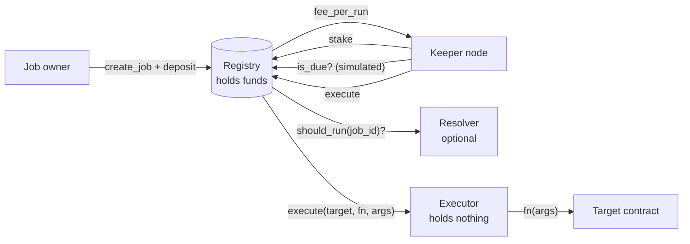

# SoroCron

**Decentralized automation for Soroban smart contracts on Stellar.**

[](https://github.com/sorocon-labs/sorocron/actions/workflows/ci.yml)
[](https://github.com/sorocon-labs/sorocron/actions/workflows/ci.yml)
[](https://sorocon-labs.github.io/sorocron/docs/)


Soroban contracts can't run themselves: nothing happens on-chain until someone sends a transaction. Every protocol that needs recurring or conditional actions (vesting releases, liquidations, rebalancing, subscription charges, DAO execution, keeping state from being archived) ends up running its own private cron server, which becomes a centralized single point of failure.

SoroCron replaces those servers with an open network:

- **Job owners** schedule contract calls and prepay a fee per run in any SEP-41 token.
- **Keepers** stake tokens, watch for due jobs, execute them, and earn the fee.
- **Resolvers** let a job run only when an on-chain condition holds.
- **TTL Guardian** keeps any contract from being archived, as an ordinary scheduled job.

## Features

| | |
|---|---|
| ⏱️ **Flexible schedules** | Fixed intervals or calendar times (daily at 09:00 UTC, weekly on Mondays), start and end times, max runs; runs stay on their grid and missed runs never fire back-to-back |
| 🧠 **Conditional jobs** | Resolver contracts decide `should_run(job_id)`; broken resolvers block instead of breaking keepers |
| 🔗 **Job chaining** | A job can follow another and run once per leader run (harvest, then compound) |
| 🛡️ **Fund-less executor** | Targets are called by a contract that owns nothing, so jobs can never borrow the registry's authority |
| 🧊 **State archival protection** | TTL Guardian extends a contract's instance and code TTL on schedule |
| 🔒 **Keeper economics** | Staking with unbonding epochs, rotating assigned windows with slashing for missed runs, an optional protocol fee, and fees that rise while a run waits |
| 🩺 **Failure handling** | Failed target calls are charged and counted; jobs pause after repeated failures; the admin can halt one target without pausing the registry |
| ⏸️ **Owner controls** | Fund, update, pause, resume or cancel jobs; refunds always available |
| 📦 **Batching** | Register up to 20 jobs with one transfer; keepers run up to 20 due jobs per transaction, skipping failures |
| 🚨 **Safe administration** | Emergency pause that never blocks exits; two-step admin handover; versioned, admin-gated upgrades |
| 🤖 **Keepers in TypeScript and Rust** | Event-indexed job tracking, channel accounts, fee bidding, webhook alerts and Prometheus metrics; Docker, systemd, Kubernetes and Helm ([guide](docs/guides/keeper-deployment.md)) |
| ⌨️ **CLI** | Create and manage jobs, stake and check keeper status from the terminal ([`keeper-bot`](keeper-bot/README.md)) |
| 🖥️ **Web dashboard** | Browse jobs, schedule and manage your own with Freighter, stake as a keeper ([`app/`](app)) |
| 🧰 **TypeScript SDK and React hooks** | Typed client, schedule and argument builders, readable errors, event reading ([`@sorocron/sdk`](packages/sdk), [`@sorocron/react`](packages/react)) |
| 📚 **Docs, tutorials and examples** | A [documentation site](https://sorocon-labs.github.io/sorocron/docs/), DCA and limit-order tutorials, and 14 example contracts ([`contracts/examples`](contracts/examples)) |

## Live on testnet

The source of truth for these addresses is [`deployments/testnet.json`](deployments/testnet.json). The [release workflow](.github/workflows/release.yml) redeploys testnet on every release and whenever Stellar resets it, and opens a pull request with the new addresses.

| Contract | Address |
|---|---|
| Registry | [`CDOAY46V2REWSINTZINUKTYELO5FYVEOCFWEKVMGH4BUJPSTRZTRGQ5W`](https://stellar.expert/explorer/testnet/contract/CDOAY46V2REWSINTZINUKTYELO5FYVEOCFWEKVMGH4BUJPSTRZTRGQ5W) |
| Executor | [`CBRQANLQBDWDUM5GRQBP7T3VZBOXG6EZEKNRNYMXTFAYWSDSJL6PPAFA`](https://stellar.expert/explorer/testnet/contract/CBRQANLQBDWDUM5GRQBP7T3VZBOXG6EZEKNRNYMXTFAYWSDSJL6PPAFA) |
| TTL Guardian | [`CB3KQFXKCL4SEBQTDGCZHJLBX365ORTHQY724SCETVS2GYZCXPGGLE73`](https://stellar.expert/explorer/testnet/contract/CB3KQFXKCL4SEBQTDGCZHJLBX365ORTHQY724SCETVS2GYZCXPGGLE73) |
| Example target (counter) | [`CDAJHPUZX55DPNTABY5OTXJYK27XWS6V744BLS5LPWMOTTI7LERGJWU2`](https://stellar.expert/explorer/testnet/contract/CDAJHPUZX55DPNTABY5OTXJYK27XWS6V744BLS5LPWMOTTI7LERGJWU2) |
| Example resolver (flag) | [`CDYKTISS6TCWDPE2NJ5YVD3FJU6ULCZXLMSQE32XQTIICMCVDDIGHWXO`](https://stellar.expert/explorer/testnet/contract/CDYKTISS6TCWDPE2NJ5YVD3FJU6ULCZXLMSQE32XQTIICMCVDDIGHWXO) |

Fee and stake token: native XLM. Min keeper stake: 1 XLM. Unbonding: 1 hour.

On-chain proof:
[scheduled job executed](https://stellar.expert/explorer/testnet/tx/306d0f2fe8df1d19114d2a3a8a9eed3c06257151bf8fa2efaa09a2a41d3a5d06) ·
[TTL Guardian job executed](https://stellar.expert/explorer/testnet/tx/4c153924f97346e98eb4957608d7fbad9f5fcd95ef1e124053be1857245ade6a) ·
[keeper node executing autonomously](https://stellar.expert/explorer/testnet/tx/3c8d106d827518a4f9ec5fe355a2c4f92597ea12b86b509ebeed19e4ddbaf377)

Stellar resets testnet periodically; the current addresses are always in [`deployments/testnet.json`](deployments/testnet.json), which the SDK, CLI, keepers and dashboard read. The [release workflow](.github/workflows/release.yml) redeploys testnet on every release tag, checks weekly that the registry still exists, and opens a pull request updating that file whenever it redeploys.

## How it works


```mermaid
flowchart LR
    O[Job owner] -- "create_job + deposit" --> R[(Registry<br/>holds funds)]
    K[Keeper node] -- stake --> R
    K -- "is_due? (simulated)" --> R
    K -- execute --> R
    R -- "should_run(job_id)?" --> V[Resolver<br/>optional]
    R -- "execute(target, fn, args)" --> E[Executor<br/>holds nothing]
    E -- "fn(args)" --> T[Target contract]
    R -- fee_per_run --> K
```

1. An owner calls `create_job` with a target contract, function, arguments, interval and fee per run, and deposits enough of the fee token to cover some runs.
2. Keepers poll `is_due(job_id)`, which is a free simulation.
3. The first keeper to land `execute` makes the registry check the schedule and resolver, advance the job, call the target **through the executor**, and pay that keeper `fee_per_run`.

Why the executor? Inside a called contract, the caller's `require_auth()` passes automatically. If the registry called targets itself, a malicious job could spend the registry's escrowed funds. The executor owns nothing, so there's nothing to steal. [Read the security model →](docs/security.md)

### Protecting a contract from archival

```text
target:   <TTL Guardian>
function: extend
args:     [<your contract>, 5_184_000 (threshold), 7_776_000 (extend_to)]
interval: 86400
```

Keepers check daily and extend your contract's instance and code TTL whenever it drops below the threshold. [Details and limitations →](docs/architecture.md#ttl-guardian)

## Quick start

**Requirements:** [Rust](https://rustup.rs) (stable), the [Stellar CLI](https://developers.stellar.org/docs/tools/cli) v25.2+ and Node.js 20+.

```bash
rustup target add wasm32v1-none
# Stellar CLI v25.2+ builds the contract WASM (soroban-sdk 28 requires it)
cargo install --locked stellar-cli

# Contracts: test and build
cargo test
stellar contract build

# TypeScript workspace: SDK, React hooks, keeper, CLI and dashboard
npm install

# Deploy your own copy to testnet (generates and funds a key in keeper-bot/.env)
npm run deploy -w sorocron-keeper-bot

# Stake, schedule counter.increment(1) every 30s and a daily TTL Guardian job, run both once
npm run demo -w sorocron-keeper-bot

# Run a keeper that executes due jobs until stopped (Ctrl+C)
npm run keeper

# Manage jobs from the terminal
npm run cli -- jobs list
npm run cli -- jobs create --target C... --function increment --arg u32:1 --every 1h --fee 0.1 --runs 24
```

Run the web dashboard (reads the testnet registry; connect [Freighter](https://www.freighter.app) on Testnet to sign):

```bash
npm run dev   # http://localhost:5173
```

### On a local network

Everything above also runs against a private network in Docker, which is
what CI's end-to-end job does on every pull request:

```bash
docker run -d -p 8000:8000 stellar/quickstart --local
export STELLAR_NETWORK=local
npm run deploy -w sorocron-keeper-bot
npm run demo -w sorocron-keeper-bot
```

`deploy` never overwrites an existing `keeper-bot/.env`; when you already
have one, the new deployment's settings go to `keeper-bot/.env.local`.

### Running a keeper

To run just the keeper node in Docker: copy `keeper-bot/.env.example` to
`keeper-bot/.env`, fill it in (`npm run deploy` above can generate the key), then
from the repository root:

```bash
docker compose -f keeper-bot/docker-compose.yml up --build
```

Prefer Rust? [`keeper-rs`](keeper-rs) is a standalone keeper that reads the same
environment variables. For systemd, Kubernetes and Helm setups, alerting and
key management, see [Running a keeper in production](docs/guides/keeper-deployment.md).

No Stellar CLI is needed; the scripts use `@stellar/stellar-sdk`. With the [Stellar CLI](https://developers.stellar.org/docs/tools/cli) you can call the registry directly:

```bash
stellar contract invoke --id CDOAY46V2REWSINTZINUKTYELO5FYVEOCFWEKVMGH4BUJPSTRZTRGQ5W --network testnet -- job_count
```

A `stellar contract invoke` example for every registry function is in [docs/cli.md](docs/cli.md).

## Contract API

### Registry

| Function | Who | Description |
|---|---|---|
| `create_job(owner, params, deposit) -> u64` | anyone | Register a job and escrow its fee deposit |
| `create_jobs(owner, jobs, deposits) -> Vec<u64>` | anyone | Register up to 20 jobs in one transfer, all or nothing |
| `update_job(job_id, update)` | job owner | Change the call, schedule, fees, limits, resolver, dependency or keeper allowlist; keeps balance |
| `fund_job(from, job_id, amount) -> i128` | anyone | Top up a job's balance |
| `set_job_active(job_id, active)` | job owner | Pause or resume a job |
| `withdraw_job_balance(job_id, amount) -> i128` | job owner | Withdraw part of a job's balance without cancelling it |
| `cancel_job(job_id) -> i128` | job owner | Delete the job and refund the balance |
| `execute(keeper, job_id)` | staked keeper | Run a due job and collect its fee |
| `execute_batch(keeper, job_ids) -> Vec<bool>` | staked keeper | Run every due job in the list, skip the rest, collect all fees in one transfer |
| `stake(keeper, amount) -> i128` | anyone | Become a keeper / add stake |
| `begin_unbonding(keeper) -> u64` | keeper | Stop executing; start the withdrawal timer |
| `withdraw_stake(keeper) -> i128` / `withdraw_stakes(keepers)` | keeper / anyone | Withdraw stake after unbonding; settle a whole unbonding epoch at once |
| `set_executor(executor)` | admin, once | Connect the executor contract |
| `propose_admin(new_admin)` / `cancel_admin_proposal()` / `accept_admin()` | admin / admin / proposed admin | Two-step admin handover |
| `set_paused(bool)` / `set_target_halted(target, bool)` | admin | Emergency pause of the registry / of every job calling one target |
| `set_min_stake`, `set_min_interval`, `set_max_args`, `set_max_failures`, `set_unbonding_epoch` | admin | Keeper and job limits |
| `set_keeper_windows(grace_period, slash_bps)` | admin | Rotating assigned windows and the slash for missing one (at most 10%) |
| `set_protocol_fee(bps, treasury)` | admin | Share of each fee sent to a treasury (at most 10%) |
| `upgrade(wasm_hash)` | admin | Replace the registry code, keeping storage and address |
| `is_due`, `current_fee`, `assigned_keeper`, `get_job`, `get_job_state`, `get_jobs(start, limit)`, `jobs_by_owner`, `job_count`, `get_keeper`, `keeper_stats`, `active_keepers`, `is_target_halted`, `config`, `pending_admin`, `version` | anyone | Read-only views |

`JobParams`: `target`, `function`, `args`, `schedule` (`Interval`, `Daily(hour, minute)` or `Weekly(weekday, hour, minute)`, UTC), `interval` (seconds; `0` for calendar schedules), `start_at` (unix time, `0` = now), `fee_per_run`, `max_fee_per_run` (`0` = flat fee), `max_runs` (`0` = unlimited), `end_at` (unix time, `0` = never), `resolver`, `after` (a job to follow) and `keepers` (an allowlist), the last three optional.

A resolver is any contract exposing `should_run(job_id: u64) -> bool`. The full interface of every contract, as generated from the built WASM, is in [`contracts/interfaces`](contracts/interfaces); CI fails if it changes without the snapshot being updated.

### Executor

| Function | Who | Description |
|---|---|---|
| `execute(target, function, args) -> Val` | registry only | Perform a job's target call |
| `registry() -> Address` | anyone | The registry this executor serves |

### TTL Guardian

| Function | Who | Description |
|---|---|---|
| `extend(contract, threshold, extend_to) -> u32` | anyone | Extend `contract`'s instance and code TTL if below `threshold` |
| `extend_many(contracts, threshold, extend_to) -> Vec<u32>` | anyone | Same, for up to 20 contracts in one call |

All error codes are listed in [docs/architecture.md](docs/architecture.md#error-codes).

## Repository layout

```
contracts/
  registry/                core contract: jobs, scheduling, fees, keeper staking, admin
  executor/                fund-less contract that performs target calls
  ttl-guardian/            scheduled TTL extension against state archival
  examples/                14 example targets and resolvers (DCA, vesting, limit order, ...)
  testkit/                 test harness: a registry, executor and keeper in one call
  bench/                   resource cost benchmarks against the built WASM
  interfaces/              generated interface snapshots, checked in CI
keeper-bot/                TypeScript keeper node, CLI, and deploy/demo scripts
keeper-rs/                 standalone keeper in Rust
packages/sdk/              @sorocron/sdk, typed TypeScript client
packages/react/            @sorocron/react, React hooks over the SDK
app/                       web dashboard (Vite + React + Freighter)
book/                      documentation site (mdBook) built from docs/
deploy/                    systemd, Kubernetes and Helm files for keepers
deployments/               deployed contract addresses per network
docs/                      architecture, security, threat model, guides and tutorials
scripts/                   interface/size snapshots and docs site assembly
```

## Documentation

The [documentation site](https://sorocon-labs.github.io/sorocron/docs/) collects these:

- Getting started: [first automated contract](docs/tutorial.md), [Stellar CLI walkthrough](docs/cli.md)
- Tutorials: [dollar-cost averaging](docs/tutorials/dca.md), [a DEX limit order](docs/tutorials/limit-order.md), [example contracts](contracts/examples/README.md)
- Design: [architecture](docs/architecture.md), [resource costs](docs/costs.md), [security model](docs/security.md), [threat model](docs/threat-model.md)
- Keepers: [keeper and CLI](keeper-bot/README.md), [Rust keeper](keeper-rs/README.md), [production deployment](docs/guides/keeper-deployment.md)
- Integrating: [TypeScript SDK](packages/sdk/README.md), [React hooks](packages/react/README.md)

## Project status

- 17 contracts (3 core, 14 examples); 186 Rust tests, including property-based fuzzing of the schedule and fee math and a fee-accounting invariant over random operation sequences
- 81 TypeScript tests (59 keeper and CLI, 14 SDK, 8 React hooks) and 7 Rust keeper tests
- CI: formatting, clippy with warnings as errors, tests, fuzzing, coverage, WASM size budget and report, interface snapshots, an end-to-end run on a local network, the docs site, and typecheck, test and build for every package
- v0.2 deployed and exercised on testnet; v0.3 (registry v4) goes to testnet through the release workflow when it's tagged
- **Not audited.** See [Security](#security) and the [threat model](docs/threat-model.md).

## Roadmap

- [x] **M1: Core.** Registry, interval scheduling, resolvers, keeper staking and unbonding, pause, reference keeper, testnet deployment
- [x] **M2: Hardening.** Fund-less executor, two-step admin, per-job pause
- [x] **M3: State archival.** TTL Guardian
- [x] **M4: Keeper economics.** Batch execution, rotating execution windows, slashing, protocol fee, fee ramps, failure tracking, unbonding epochs
- [x] **M5: Developer experience.** Typed TypeScript SDK, React hooks, web dashboard, job management CLI, Rust keeper, examples and tutorials, docs site
- [ ] **M6: Mainnet.** ~~Invariant and fuzz testing, threat model~~ (v0.3), external audit, mainnet deployment

See the [changelog](CHANGELOG.md) for what shipped in each release. Open work is tracked in [issues](https://github.com/sorocon-labs/sorocron/issues), labelled by area and complexity.

## Contributing

Contributions are welcome, including through [Drips Wave](https://www.drips.network/wave). Read [CONTRIBUTING.md](CONTRIBUTING.md), pick an issue labelled `good first issue` or `complexity: *`, and comment to get assigned. Please follow the [code of conduct](CODE_OF_CONDUCT.md).

## Security

SoroCron is **unaudited**. Don't use it with real funds. Report vulnerabilities privately as described in [SECURITY.md](SECURITY.md).

## License

[MIT](LICENSE)
