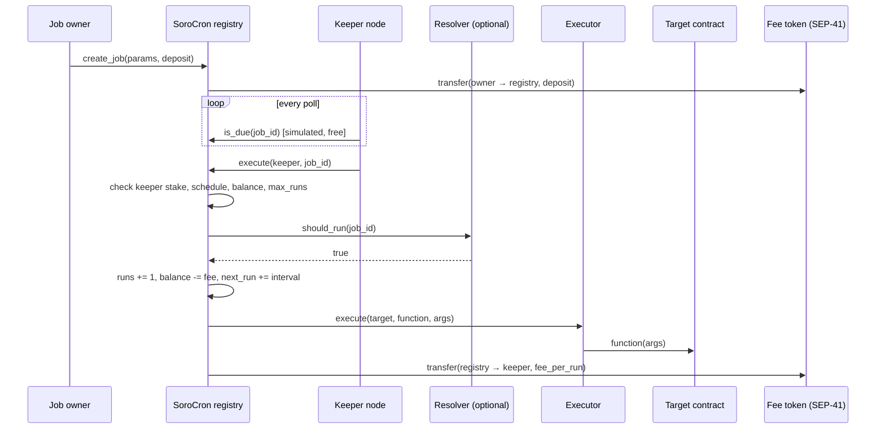

# Architecture

SoroCron has three layers:

1. **Registry contract** (`contracts/registry`): the on-chain source of truth. It stores jobs, escrows fees, tracks keeper stake, and decides when jobs run. **Executor contract** (`contracts/executor`): performs the actual target calls on the registry's behalf and holds no funds (see [security](security.md)).
2. **Keeper nodes** (`keeper-bot`): off-chain processes that watch the registry and submit `execute` transactions when jobs are due. Anyone can run one.
3. **Integrations**: target contracts (the functions being automated) and optional resolver contracts (conditions).



## Data model

| Key | Storage | Contents |
|---|---|---|
| `Config` | instance | admin, fee token, stake token, min stake, unbonding period, paused flag, executor, min interval, max args |
| `NextJobId` | instance | monotonically increasing job id counter |
| `PendingAdmin` | instance | admin proposed via `propose_admin`, until accepted |
| `Job(u64)` | persistent | owner, target, function, args, interval, next_run, fee_per_run, balance, max_runs, runs, end_at, resolver, active |
| `Keeper(Address)` | persistent | stake, unbonding_at, executions |

Every read and write of a persistent entry extends its TTL (30 days), so active jobs and keepers never get archived. The instance is extended to 7 days on every call.

## Scheduling

- `next_run` starts at `max(start_at, now)`.
- A job is **due** when `now >= next_run`, its balance covers one fee, `max_runs` isn't reached, `end_at` (if set) hasn't passed, and its resolver (if any) returns `true`.
- After a run, `next_run = next_run + interval`. If keepers were offline long enough that this is already in the past, it becomes `now + interval` instead, so missed runs don't fire back-to-back.
- `end_at` is an optional Unix timestamp (`0` means never) after which the job stops being due, even if it hasn't hit `max_runs` and its balance is still funded. Unlike `max_runs`, it expires by wall-clock time rather than by run count &mdash; useful for jobs tied to a calendar date, like a campaign that ends on a given day. Once `now >= end_at`, `execute` fails with `JobExpired`; the job can still be cancelled or have its balance withdrawn.

Time is measured with the ledger timestamp (seconds). Ledgers close about every 5 seconds, so that is the practical minimum resolution.

## Keepers

- `stake` registers a keeper and adds stake. A keeper may execute while `stake >= min_stake` and it is not unbonding.
- `begin_unbonding` immediately removes execution rights and starts a `unbonding_period` timer.
- `withdraw_stake` returns the full stake after the timer ends.

Execution is currently first-come-first-served: whichever keeper lands `execute` first gets the fee, and the others' transactions fail cheaply during simulation. Planned: rotating execution windows per keeper and slashing for missed windows (see the issue backlog).

## Resolvers

A resolver is any contract that exposes:

```rust
fn should_run(env: Env, job_id: u64) -> bool;
```

The registry calls it with `try_invoke_contract`, so a resolver that panics or doesn't exist simply blocks execution (`ResolverRejected`) instead of breaking `is_due` for keepers.

## TTL Guardian

Stellar archives contract entries whose TTL runs out; an archived contract stops working until someone restores it. Extending TTL is permissionless, but somebody has to remember to do it, and forgetting breaks production.

`contracts/ttl-guardian` turns this into an ordinary SoroCron job:

```text
target:   <ttl-guardian>
function: extend
args:     [contract_to_protect, threshold_ledgers, extend_to_ledgers]
interval: 86400   (check daily)
```

Each run extends the protected contract's **instance and code** TTL to `extend_to` whenever it has dropped below `threshold` (and does nothing otherwise). `extend_to` is capped at the network maximum. The job is paid for like any other, so the protocol never has to run its own bot.

Limitation: a contract can only extend another contract's instance and code, not its persistent storage entries. Contracts that need persistent data kept alive should expose a permissionless `extend_ttl` function that bumps their own entries, and schedule that directly.

The test `guardian_job_keeps_target_contract_from_being_archived` runs this end to end through the registry, executor and a keeper.

## Error codes

| Code | Name | Meaning |
|---|---|---|
| 1 | `Paused` | Registry is paused by the admin |
| 2 | `JobNotFound` | No job with this id (never created or cancelled) |
| 3 | `InvalidInterval` | `interval` must be > 0 |
| 4 | `InvalidFee` | `fee_per_run` must be > 0 |
| 5 | `InvalidAmount` | Amount must be positive / deposit must cover one run |
| 6 | `ForbiddenTarget` | Target is the registry or a token it custodies |
| 7 | `JobNotDue` | `now < next_run` |
| 8 | `InsufficientJobBalance` | Balance can't cover `fee_per_run` |
| 9 | `MaxRunsReached` | Job hit `max_runs` |
| 10 | `ResolverRejected` | Resolver returned false or failed |
| 11 | `KeeperNotFound` | Caller never staked |
| 12 | `InsufficientStake` | Stake below `min_stake` |
| 13 | `KeeperUnbonding` | Keeper is unbonding |
| 14 | `UnbondingNotStarted` | `withdraw_stake` before `begin_unbonding` |
| 15 | `UnbondingNotFinished` | Unbonding period not over |
| 16 | `ExecutorNotSet` | Admin hasn't connected the executor yet |
| 17 | `ExecutorAlreadySet` | The executor can only be set once |
| 18 | `NoPendingAdmin` | `accept_admin` called with no proposal outstanding |
| 19 | `JobPaused` | The owner paused this job with `set_job_active` |
| 20 | `JobExpired` | `now >= end_at` |
| 21 | `IntervalTooShort` | `interval` below the admin-configured `min_interval` |
| 22 | `TooManyArgs` | `args` longer than the admin-configured `max_args` |
