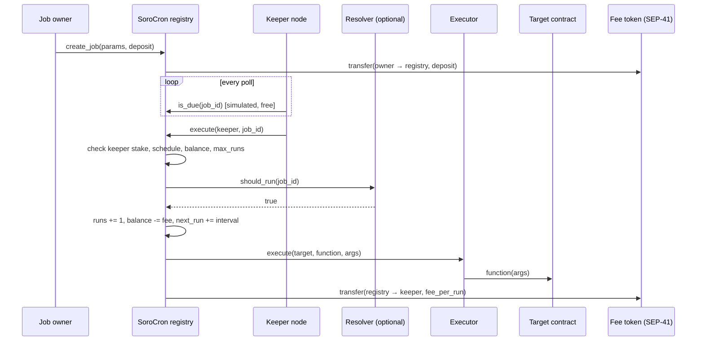

# Architecture

SoroCron has three layers:

1. **Registry contract** (`contracts/registry`): the on-chain source of truth. It stores jobs, escrows fees, tracks keeper stake, and decides when jobs run. **Executor contract** (`contracts/executor`): performs the actual target calls on the registry's behalf and holds no funds (see [security](security.md)).
2. **Keeper nodes** (`keeper-bot`): off-chain processes that watch the registry and submit `execute` transactions when jobs are due. Anyone can run one.
3. **Integrations**: target contracts (the functions being automated) and optional resolver contracts (conditions).


```mermaid
sequenceDiagram
    participant Owner as Job owner
    participant Registry as SoroCron registry
    participant Keeper as Keeper node
    participant Resolver as Resolver (optional)
    participant Executor as Executor
    participant Target as Target contract
    participant Token as Fee token (SEP-41)

    Owner->>Registry: create_job(params, deposit)
    Registry->>Token: transfer(owner → registry, deposit)

    loop every poll
        Keeper->>Registry: is_due(job_id)  [simulated, free]
    end

    Keeper->>Registry: execute(keeper, job_id)
    Registry->>Registry: check keeper stake, schedule, balance, max_runs
    Registry->>Resolver: should_run(job_id)
    Resolver-->>Registry: true
    Registry->>Registry: runs += 1, balance -= fee, next_run += interval
    Registry->>Executor: execute(target, function, args)
    Executor->>Target: function(args)
    Registry->>Token: transfer(registry → keeper, fee_per_run)
```

## Data model

| Key | Storage | Contents |
|---|---|---|
| `Config` | instance | admin, tokens, min stake, unbonding period and epoch, paused flag, executor, min interval, max args, protocol fee and treasury, max failures, grace period, slash share |
| `NextJobId` | instance | monotonically increasing job id counter |
| `PendingAdmin` | instance | admin proposed via `propose_admin`, until accepted |
| `Job(u64)` | persistent | `JobSpec`: owner, target, function, args, interval, schedule, fees, max_runs, end_at, resolver, keeper allowlist, leader job |
| `JobState(u64)` | persistent | `JobState`: next_run, balance, runs, consecutive failures, active, leader's run count for chained jobs |
| `Keeper(Address)` | persistent | stake, unbonding_at, executions, total lateness, missed windows, slashed stake |
| `ActiveKeepers` | persistent | keepers in the assigned-window rotation, in staking order (max 64) |
| `HaltedTarget(Address)` | persistent | present while the admin has halted a target contract |

A job is split in two entries so that a run rewrites only the small `JobState`, however large the job's arguments are. Before v4 every run rewrote the whole job; measured with `cargo run -p sorocron-bench`, `execute` now writes 15% fewer bytes for a one-argument job, the same amount for a job with 1 KB of arguments, and `execute_batch` of five jobs writes 41% less ([costs](costs.md)). Views return the combined `Job`.

Every read and write of a persistent entry extends its TTL (30 days), so active jobs and keepers never get archived. The instance is extended to 7 days on every call.

## Scheduling

- A job's `schedule` is `Interval` (every `interval` seconds), `Daily(hour, minute)` or `Weekly(weekday, hour, minute)` in UTC, with Monday as weekday `0`. Calendar schedules must pass `interval = 0`; their stored interval is a day or a week.
- `next_run` starts at `max(start_at, now)`, or for calendar schedules at the first matching time at or after it.
- A job is **due** when it is active, `max_runs` isn't reached, `end_at` (if set) hasn't passed, its balance covers one base fee, `now >= next_run`, its target isn't halted, and its resolver (if any) returns `true`.
- After a run, `next_run` moves to the next point on the job's grid (`first_run + k * interval`) that is after `now`. Missed runs are skipped instead of firing back-to-back, and calendar jobs never drift: a daily 12:00 job stays at 12:00 however late a keeper was.
- `end_at` is an optional Unix timestamp (`0` means never) after which the job stops being due. Once `now >= end_at`, `execute` fails with `JobExpired`; the job can still be cancelled or have its balance withdrawn.

Computation is integer-only. The schedule math lives in `contracts/registry/src/schedule.rs` and is property-tested for midnight boundaries, weekday alignment, missed runs and `u64` overflow.

### Fees

- `fee_per_run` is charged for every run. With `max_fee_per_run` set, the fee rises linearly from `fee_per_run` when the run becomes due to `max_fee_per_run` once it is a full interval late, so time-sensitive jobs (liquidations, rebalances) pay more the longer they wait. It never exceeds the job's balance. `current_fee(job_id)` shows the fee right now.
- With a protocol fee configured, `protocol_fee_bps` (at most 10%) of each fee goes to the treasury, rounded down; the keeper receives the rest.

Time is measured with the ledger timestamp (seconds). Ledgers close about every 5 seconds, so that is the practical minimum resolution.

## Keepers

- `stake` registers a keeper, adds stake and puts it in the assigned-window rotation (up to 64 keepers; later keepers can still run any job after its window). A keeper may execute while `stake >= min_stake` and it is not unbonding.
- `begin_unbonding` immediately removes execution rights, takes the keeper out of the rotation and starts the unbonding timer. With an `unbonding_epoch` set, the timer starts when the current epoch ends, so every keeper unbonding in one epoch is released at the same moment; `withdraw_stakes(keepers)` lets anyone settle a whole epoch in one transaction, paying each keeper its own stake.
- `withdraw_stake` returns the full stake after the timer ends.
- `keeper_stats(keeper)` returns executions, average lateness (seconds between a run becoming due and the keeper running it), missed windows and stake lost to slashing. Lateness is stored as a running sum, so the record stays a fixed size.

### Assigned windows and slashing

First come, first served makes the fastest bot win every fee and wastes everyone else's simulations. With `set_keeper_windows(grace_period, slash_bps)`:

1. Each run of each job has an assigned keeper, chosen by `sha256(job_id, runs) % n` over the job's keeper allowlist, or the rotation if it has none. `assigned_keeper(job_id)` shows it.
2. For `grace_period` seconds after `next_run`, only the assigned keeper may execute (`NotAssignedKeeper` otherwise).
3. After the window anyone may execute. If someone other than the assigned keeper does, the assigned keeper loses `slash_bps` (at most 10%) of its stake to the keeper that did the work, and its `missed` count goes up (`KeeperSlashed` event).
4. An assigned keeper that can't execute (unbonding, or below `min_stake`, for example after being slashed) is skipped: the run is open to everyone and nobody is slashed for it.

`grace_period = 0` (the default) keeps first come, first served.

### Keeper allowlists

A job may set `keepers` to at most 10 addresses. Only those keepers can execute it (`KeeperNotAllowed`), and its assigned windows rotate among them.

## Failures and receipts

The executor call is made with `try_execute`. If the target fails, the run still counts: the fee is charged, the schedule advances and the job's `failures` counter goes up. After `max_failures` consecutive failures (3 by default, `0` disables) the job pauses itself with a `JobDeactivated` event. A successful run resets the counter, and so does the owner resuming the job. See [security.md](security.md#failure-charging) for why failures are charged.

Every run emits one `JobExecuted` receipt with the outcome (`success`), the total fee and protocol share, the run number, the next run, how late it ran, the failure count and a hash of the return value (or error). CPU and memory use aren't observable from inside a contract; keepers read them from the transaction result.

## Chaining jobs

A job can follow another: with `after: Some(leader_id)` it is due only once
the leader has run again since the follower last ran, so the follower runs
exactly once per leader run (harvest, then compound). Following starts from
the leader's run count when the link is made, so earlier leader runs don't
count. If the leader is cancelled the follower waits (`AwaitingDependency`)
until its owner removes or changes the dependency with `update_job`.

This lives in the registry rather than in a resolver because Soroban forbids
contract re-entry: when the registry asks a resolver `should_run`, the
resolver cannot call back into the registry to read another job's state.
The registry already holds both jobs, so the check costs one extra read.

## Circuit breakers

- `set_paused(true)` stops all execution and deposits; exits keep working.
- `set_target_halted(target, true)` stops every job calling one contract (`TargetHalted`) without touching the rest of the registry, for when a target is compromised. Owners can still withdraw and cancel.
- Owners pause their own jobs with `set_job_active`.

## Resolvers

A resolver is any contract that exposes:

```rust
fn should_run(env: Env, job_id: u64) -> bool;
```

The registry calls it with `try_invoke_contract`, so a resolver that panics or doesn't exist simply blocks execution (`ResolverRejected`) instead of breaking `is_due` for keepers.

## TTL Guardian

Stellar archives contract entries whose TTL runs out; an archived contract stops working until someone restores it. Extending TTL is permissionless, but somebody has to remember to do it, and forgetting breaks production.

`contracts/ttl-guardian` turns this into an ordinary SoroCron job:

```text
target:   <ttl-guardian>
function: extend
args:     [contract_to_protect, threshold_ledgers, extend_to_ledgers]
interval: 86400   (check daily)
```

Each run extends the protected contract's **instance and code** TTL to `extend_to` whenever it has dropped below `threshold` (and does nothing otherwise). `extend_to` is capped at the network maximum. The job is paid for like any other, so the protocol never has to run its own bot.

Limitation: a contract can only extend another contract's instance and code, not its persistent storage entries. Contracts that need persistent data kept alive should expose a permissionless `extend_ttl` function that bumps their own entries, and schedule that directly; [`examples/self-extending`](../contracts/examples/self-extending) shows the pattern, with a test that the data lapses when the job is removed.

Which to use:

| Need | Schedule |
|---|---|
| Keep a contract's code and instance storage alive | The TTL Guardian's `extend` |
| Keep a contract's persistent entries alive | The contract's own `extend_ttl` (you add it) |
| Both | Both jobs, or have `extend_ttl` bump the instance too, as the example does |

Since protocol 23, archived entries can be restored automatically, but the transaction that touches them pays the restore fee. Keeping them alive is cheaper and avoids surprising the next user with that fee.

The test `guardian_job_keeps_target_contract_from_being_archived` runs this end to end through the registry, executor and a keeper.

## Error codes

| Code | Name | Meaning |
|---|---|---|
| 1 | `Paused` | Registry is paused by the admin |
| 2 | `JobNotFound` | No job with this id (never created or cancelled) |
| 3 | `InvalidInterval` | `interval` must be > 0 |
| 4 | `InvalidFee` | `fee_per_run` must be > 0 |
| 5 | `InvalidAmount` | Amount must be positive / deposit must cover one run |
| 6 | `ForbiddenTarget` | Target is the registry or a token it custodies |
| 7 | `JobNotDue` | `now < next_run` |
| 8 | `InsufficientJobBalance` | Balance can't cover `fee_per_run` |
| 9 | `MaxRunsReached` | Job hit `max_runs` |
| 10 | `ResolverRejected` | Resolver returned false or failed |
| 11 | `KeeperNotFound` | Caller never staked |
| 12 | `InsufficientStake` | Stake below `min_stake` |
| 13 | `KeeperUnbonding` | Keeper is unbonding |
| 14 | `UnbondingNotStarted` | `withdraw_stake` before `begin_unbonding` |
| 15 | `UnbondingNotFinished` | Unbonding period not over |
| 16 | `ExecutorNotSet` | Admin hasn't connected the executor yet |
| 17 | `ExecutorAlreadySet` | The executor can only be set once |
| 18 | `NoPendingAdmin` | `accept_admin` called with no proposal outstanding |
| 19 | `JobPaused` | The owner paused this job with `set_job_active` |
| 20 | `JobExpired` | `now >= end_at` |
| 21 | `IntervalTooShort` | `interval` below the admin-configured `min_interval` |
| 22 | `TooManyArgs` | `args` longer than the admin-configured `max_args` |
| 23 | `TargetFailed` | Not returned since v4: failed runs are recorded instead (see Failures and receipts) |
| 24 | `InvalidBatchSize` | `create_jobs` / `execute_batch` got 0 or more than 20 items |
| 25 | `LengthMismatch` | `create_jobs` got different numbers of jobs and deposits |
| 26 | `KeeperNotAllowed` | The job has a keeper allowlist and the caller isn't on it |
| 27 | `NotAssignedKeeper` | Inside the grace period only the run's assigned keeper may execute |
| 28 | `TargetHalted` | The admin halted every job calling this target |
| 29 | `InvalidCalendar` | Calendar hour, minute or weekday out of range, or a calendar with a non-zero interval |
| 30 | `InvalidSetting` | Protocol fee or slash share above 10%, fee ceiling below the base fee, or a protocol fee without a treasury |
| 31 | `TooManyKeepers` | Keeper allowlist longer than 10 |
| 32 | `AwaitingDependency` | The job follows another job that hasn't run again since, or no longer exists |
