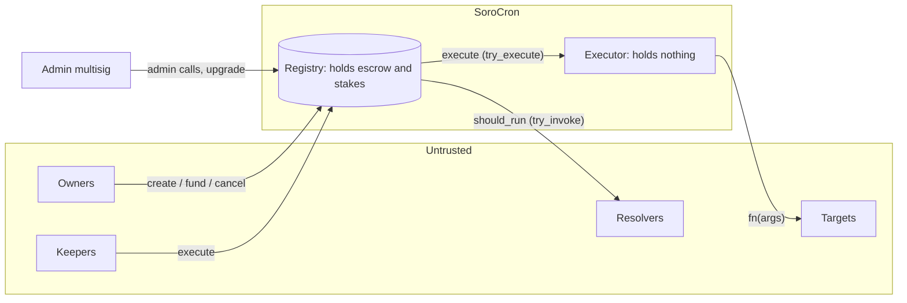

# Threat model

What SoroCron protects, from whom, and how. Covers the registry, executor,
TTL Guardian and keeper nodes as of registry interface v4. Read
[security.md](security.md) first for the design rationale; this document is
the structured list auditors and reviewers can check item by item.

## Actors

| Actor | Trust | Can |
|---|---|---|
| **Job owner** | Untrusted toward others | Create, fund, update, pause and cancel their own jobs; choose any target, arguments, resolver, keeper allowlist and leader job |
| **Keeper** | Untrusted, staked | Execute due jobs; stake, unbond, withdraw; choose which jobs to run and when to submit |
| **Admin** | Trusted (should be a multisig) | Pause the registry, halt targets, set limits, protocol fee and slashing (capped at 10%), connect the executor once, announce upgrades that wait at least the unbonding time |
| **Target contract** | Untrusted | Run arbitrary code when called by the executor |
| **Resolver contract** | Untrusted | Answer `should_run`; run arbitrary code during that call |
| **Anyone** | Untrusted | Fund any job, settle matured stakes, read everything |
| **RPC provider** | Untrusted by contracts; trusted for liveness by keepers | Serve or withhold data, delay transactions |

## Assets

1. **Escrowed job balances** (fee token) held by the registry.
2. **Keeper stakes** (stake token) held by the registry.
3. **The registry's authority:** its address authorizes token transfers out of escrow.
4. **Schedule integrity:** jobs run when due, at most once per slot, and only while funded and allowed.
5. **Keeper revenue:** fees paid to whoever does the work.
6. **Availability** of the registry and of exits (cancel, withdraw).

## Trust boundaries

The critical boundary is between the registry and job targets. Targets are
never called by the registry itself, only by the executor, which owns nothing
(see [security.md](security.md#invoker-authority-and-the-executor-split)).

## Threats (STRIDE)

| # | Category | Threat | Mitigation | Status |
|---|---|---|---|---|
| S1 | Spoofing | A job's target acts with the registry's authority to transfer escrow | Targets are called through the fund-less executor; `targets_cannot_use_registry_authority` test; jobs may not target the registry, executor or custodied tokens | Mitigated |
| S2 | Spoofing | Someone executes as a keeper they don't control | `keeper.require_auth()` on `execute` and `execute_batch` | Mitigated |
| S3 | Spoofing | A non-owner updates, pauses, withdraws from or cancels a job | Owner `require_auth()` on every owner function; tests for each | Mitigated |
| S4 | Spoofing | A non-admin takes over admin | Two-step `propose_admin` / `accept_admin`; tests | Mitigated |
| T1 | Tampering | A job runs early, twice per slot, or after its end | `ensure_due` gates; grid-aligned `next_run` always moves past `now`; property tests over `u64` edges | Mitigated |
| T2 | Tampering | Arithmetic overflow corrupts balances or schedules | Saturating schedule math, checked fee split, `overflow-checks` in release; proptests at the `u64`/`i128` extremes | Mitigated |
| T3 | Tampering | Escrow accounting drifts from token balances | Fee accounting invariant fuzzed with 1,000 random operation sequences per CI run | Mitigated |
| T4 | Tampering | A keeper fakes a target failure to collect fees without doing the work | Budget and footprint errors are non-recoverable, so the whole transaction fails | Mitigated |
| T5 | Tampering | A malicious upgrade drains escrow | Upgrades are announced with `propose_upgrade` and can't be applied before `unbonding_period + unbonding_epoch`, so owners and keepers can withdraw first; policy requires a multisig admin | Mitigated, users must watch for upgrades (R1) |
| R1 | Repudiation | Disputes over whether a job ran or why it failed | Every run emits a `JobExecuted` receipt with outcome, fee split, lateness and result hash; config changes emit events | Mitigated |
| I1 | Information disclosure | Job arguments are public | By design: all contract state is public. Don't put secrets in job arguments | Accepted |
| D1 | Denial of service | A broken resolver blocks keepers | Resolvers are called with `try_invoke`; failure means "not ready" | Mitigated |
| D2 | Denial of service | A target that always fails wastes keeper simulations forever | Failed runs are charged and the job pauses after `max_failures` | Mitigated |
| D3 | Denial of service | A job with huge arguments makes execution exceed resource limits | `max_args` limit; split storage keeps per-run writes small; jobs over the limit simply can't run | Mitigated |
| D4 | Denial of service | The admin pause traps funds | Exits (`cancel_job`, `withdraw_job_balance`, unbonding, `withdraw_stake(s)`) work while paused or halted | Mitigated |
| D5 | Denial of service | Keeper entries or jobs get archived | TTLs are extended on every read and write; the TTL Guardian and self-extending pattern cover user contracts | Mitigated |
| D6 | Denial of service | The fastest bot wins every run, so others stop keeping | Assigned keeper windows with slashing for missed windows | Mitigated when enabled (R3) |
| D7 | Denial of service | An RPC provider withholds events, so keepers miss jobs | Keepers reload from scratch when the event cursor fails and every `RESYNC_EVERY_TICKS`; multiple keepers on different providers | Partially mitigated (R4) |
| E1 | Elevation | A resolver or target re-enters the registry mid-run | Soroban forbids contract re-entry | Mitigated |
| E2 | Elevation | Slashing drains more than the configured share | `slash_bps` capped at 10% of current stake; ineligible keepers are never assigned or slashed | Mitigated |
| E3 | Elevation | A chained job runs without its leader | `after` is checked inside the registry, not by an external contract; a missing leader blocks the follower | Mitigated |

## Open risks

| # | Risk | Notes |
|---|---|---|
| R1 | **Admin key compromise.** The admin can propose an upgrade that redirects escrow. | The upgrade timelock gives owners and keepers at least the unbonding time to withdraw, but only if they notice the `UpgradeProposed` event. Deploy with a multisig admin. |
| R2 | **Unaudited code.** | No external audit yet. Don't use with funds you can't afford to lose. |
| R3 | **Windows are off by default.** With `grace_period = 0` execution is first come, first served. | The admin enables windows with `set_keeper_windows`. Rotation is capped at 64 keepers. |
| R4 | **Single-RPC keepers.** A keeper relying on one RPC provider can be starved of data. | Give each keeper several `STELLAR_RPC_URLS` to fail over between, and run keepers on different providers; the index resyncs from scratch periodically. |
| R5 | **Oracle-dependent resolvers** inherit their oracle's trust. | The example price and NFT resolvers ignore stale data, but can't detect a wrong fresh price. |
| R6 | **Fee economics.** Jobs whose fee doesn't cover the network fee won't be run. | Keepers skip unprofitable batches by design. Owners should check [costs](costs.md) and use a fee ceiling for time-sensitive jobs. |

Report suspected vulnerabilities privately: see [SECURITY.md](../SECURITY.md).
