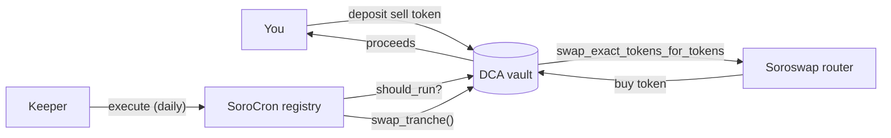

# Dollar-cost averaging on testnet

Buy a token a little at a time, every day, through
[Soroswap](https://soroswap.finance), with SoroCron keepers doing the
buying. The vault contract is
[`contracts/examples/dca`](../../contracts/examples/dca).

What you'll set up:



## Why the vault is safe to leave to any keeper

- A tranche can run once per interval, counted from the previous tranche,
  and `max_swaps` caps the total. Calling `swap_tranche` early or twice fails
  with `NotDueYet`.
- Every swap passes `amount_out_min = amount_per_swap * min_price`. If
  someone moves the pool price against you first, the swap fails instead of
  filling badly.
- The vault authorizes the router to move exactly one tranche of the sell
  token (Soroswap pulls the input from `to` into the pair), nothing else.

## Prerequisites

- [Stellar CLI](https://developers.stellar.org/docs/tools/cli) 25.2+ and the
  contracts built: `stellar contract build`
- A funded testnet identity: `stellar keys generate me --network testnet --fund`
- Two tokens with a Soroswap pool between them. On testnet, Soroswap's
  [faucet](https://app.soroswap.finance) mints test USDC; the examples below
  sell USDC for XLM.

Addresses used below (testnet, check them before use since testnet resets):

| | |
|---|---|
| Soroswap router | `CCJUD55AG6W5HAI5LRVNKAE5WDP5XGZBUDS5WNTIVDU7O264UZZE7BRD` (from [soroswap/core](https://github.com/soroswap/core/blob/main/public/testnet.contracts.json)) |
| Native XLM token | `stellar contract id asset --asset native --network testnet` |
| SoroCron registry | [`deployments/testnet.json`](../../deployments/testnet.json) |

```bash
ROUTER=CCJUD55AG6W5HAI5LRVNKAE5WDP5XGZBUDS5WNTIVDU7O264UZZE7BRD
XLM=$(stellar contract id asset --asset native --network testnet)
USDC=<test USDC contract id>
ME=$(stellar keys address me)
```

## 1. Deploy the vault

Sell 10 USDC per day for 30 days, accepting no less than 7.5 XLM per USDC
(`min_price` is scaled by 10^7). Amounts use 7 decimals.

```bash
VAULT=$(stellar contract deploy \
  --wasm target/wasm32v1-none/release/sorocron_example_dca.wasm \
  --source me --network testnet -- \
  --owner $ME --router $ROUTER \
  --sell_token $USDC --buy_token $XLM \
  --amount_per_swap 100000000 --interval 86400 --max_swaps 30 \
  --min_price 75000000)
```

## 2. Fund it

```bash
stellar contract invoke --id $VAULT --source me --network testnet -- \
  deposit --from $ME --amount 3000000000   # 300 USDC: 30 tranches
```

## 3. Schedule it

Using the TypeScript SDK (`npm install @sorocron/sdk`):

```ts
import { SoroCron, TESTNET, schedule, parseAmount } from "@sorocron/sdk";

const cron = await SoroCron.connect({ network: TESTNET, publicKey, signTransaction });
const { result: jobId } = await cron.createJob(
  {
    target: VAULT,
    function: "swap_tranche",
    args: [],
    interval: 86_400n,
    schedule: schedule.interval(),
    start_at: 0n,
    fee_per_run: parseAmount("0.05"),
    max_fee_per_run: 0n,
    max_runs: 30,
    end_at: 0n,
    resolver: VAULT, // the vault is its own resolver
  },
  parseAmount("1.5"), // 30 runs at 0.05 XLM
);
```

Or from the [dashboard](../../app): New job, then Contract call, with
`swap_tranche` and no arguments, every 1 day, then set the vault as the
resolver under "Run only when a condition holds".

## 4. Watch it

```bash
stellar contract invoke --id $VAULT --network testnet -- get_plan
```

`executed_swaps` goes up by one a day and the XLM arrives in your account.
To stop early:

```bash
stellar contract invoke --id $VAULT --source me --network testnet -- cancel
```

which refunds the unspent USDC. Cancel the SoroCron job too to get its
remaining fee balance back.

## Testing locally

The vault's tests run the same flow against a mock router through a real
registry and keeper, with only the keeper's signature mocked, so the vault's
own authorization of the router's transfer is checked for real:

```bash
cargo test -p sorocron-example-dca
```
