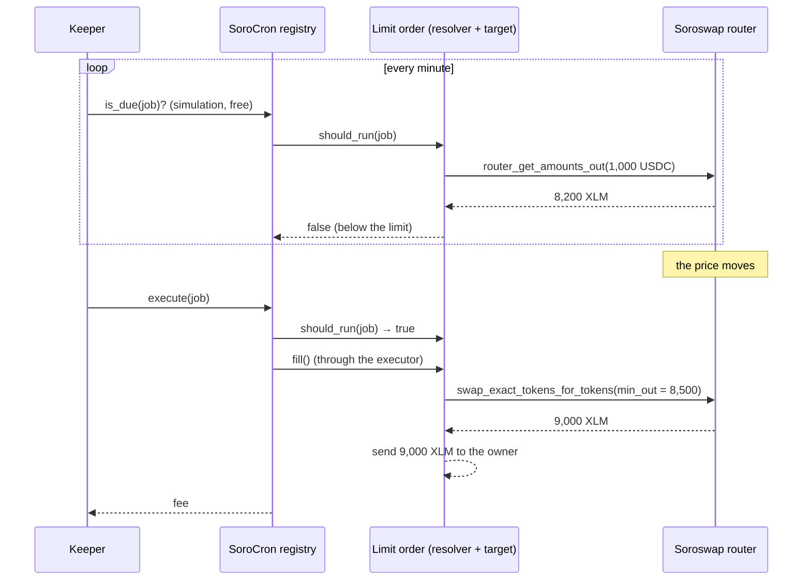

# Tutorial: a DEX limit order with SoroCron

Soroswap has no order book: a swap fills at whatever the pool pays right
now. This tutorial builds a **limit order**, "sell 1,000 USDC for at least
8,500 XLM", that fills on its own as soon as the market allows, by letting a
SoroCron keeper watch the price for you.

You'll deploy the order contract from
[`contracts/examples/limit-order`](../../contracts/examples/limit-order),
fund it, and schedule a job that checks every minute and fills it once the
price is right.

## How it fits together



The order contract plays two roles:

- **Resolver:** `should_run` asks the router for a quote and answers `true`
  once 1,000 USDC buys at least 8,500 XLM. Keepers check this for free in
  simulation, so you pay nothing while you wait.
- **Target:** `fill()` performs the swap. It passes your limit as the
  router's `amount_out_min`, so even if the price moves between the quote
  and the swap (or someone moves it on purpose), the swap fails rather than
  filling below your limit.

## The contract

The interesting parts of [`limit-order/src/lib.rs`](../../contracts/examples/limit-order/src/lib.rs):

```rust
pub fn should_run(env: Env, _job_id: u64) -> bool {
    let order = load(&env);
    ensure_fillable(&env, &order).is_ok()            // funded, open, not expired
        && Self::quote(env) >= order.min_amount_out  // market pays at least the limit
}

pub fn fill(env: Env) -> Result<i128, Error> {
    let mut order = load(&env);
    ensure_fillable(&env, &order)?;
    if Self::quote(env.clone()) < order.min_amount_out {
        return Err(Error::PriceNotReached);
    }
    order.open = false;                              // can only fill once
    save(&env, &order);

    // Soroswap pulls the input from `to` (this contract) into the pair, so
    // authorize exactly that transfer and nothing else.
    let pair = router.router_pair_for(&order.sell_token, &order.buy_token);
    env.authorize_as_current_contract(vec![&env, /* sell_token.transfer(me, pair, amount_in) */]);

    let amounts = router.swap_exact_tokens_for_tokens(
        &order.amount_in,
        &order.min_amount_out,                       // the limit, enforced by the router
        &path,
        &me,
        &env.ledger().timestamp(),
    );
    // forward the proceeds to the owner
}
```

Run its tests, which fill an order through a real registry and keeper with
only the keeper's signature mocked, so the contract's own authorization of
the router is checked for real:

```bash
cargo test -p sorocron-example-limit-order
```

## Deploy it on testnet

You need the [Stellar CLI](https://developers.stellar.org/docs/tools/cli)
25.2+, the contracts built (`stellar contract build`), and a funded testnet
identity:

```bash
stellar keys generate trader --network testnet --fund
TRADER=$(stellar keys address trader)
ROUTER=CCJUD55AG6W5HAI5LRVNKAE5WDP5XGZBUDS5WNTIVDU7O264UZZE7BRD   # Soroswap testnet router
XLM=$(stellar contract id asset --asset native --network testnet)
USDC=<test USDC contract id>   # mint some at https://app.soroswap.finance
```

Check what the pool pays today, to pick a limit a little above it:

```bash
stellar contract invoke --id $ROUTER --network testnet -- \
  router_get_amounts_out --amount_in 10000000000 --path "[\"$USDC\",\"$XLM\"]"
```

Deploy and fund the order. Amounts have 7 decimals, so 1,000 USDC is
`10000000000` and 8,500 XLM is `85000000000`; `expires_at` is a unix time
(or `0` for never):

```bash
ORDER=$(stellar contract deploy \
  --wasm target/wasm32v1-none/release/sorocron_example_limit_order.wasm \
  --source trader --network testnet -- \
  --owner $TRADER --router $ROUTER \
  --sell_token $USDC --buy_token $XLM \
  --amount_in 10000000000 --min_amount_out 85000000000 \
  --expires_at $(( $(date +%s) + 7*86400 )))

stellar contract invoke --id $ORDER --source trader --network testnet -- fund
stellar contract invoke --id $ORDER --network testnet -- quote
```

## Schedule it

### From JavaScript

```ts
import { contract } from "@stellar/stellar-sdk";
import { SoroCron, TESTNET, parseAmount, schedule } from "@sorocron/sdk";

const cron = await SoroCron.connect({
  network: TESTNET,
  publicKey: TRADER,
  ...contract.basicNodeSigner(traderKeypair, TESTNET.networkPassphrase),
});

const { result: jobId } = await cron.createJob(
  {
    target: ORDER,
    function: "fill",
    args: [],
    interval: 60n,                    // check every minute
    schedule: schedule.interval(),
    start_at: 0n,
    fee_per_run: parseAmount("0.05"),
    max_fee_per_run: parseAmount("0.5"), // pay more the longer a fill waits
    max_runs: 1,                      // it only ever fills once
    end_at: 0n,
    resolver: ORDER,                  // only run when the quote reaches the limit
  },
  parseAmount("0.5"),                 // enough for one run at the highest fee
);
console.log(`watching with job ${jobId}`);
```

### Or from the SoroCron CLI

```bash
npm run cli -- jobs create --target $ORDER --function fill \
  --every 1m --resolver $ORDER --fee 0.05 --max-fee 0.5 --runs 10 --max-runs 1
```

The job checks every minute, costs nothing while the price is below your
limit, and pays a keeper to fill the order the moment it can. The fee rises
from 0.05 to 0.5 XLM if a fill sits unexecuted, so keepers prioritise it.

## Watch it

```bash
npm run cli -- jobs show <job id>                                # "a keeper can run it now" once the price is right
stellar contract invoke --id $ORDER --network testnet -- order   # open: false, filled_out: <XLM received>
```

## Cancelling

```bash
stellar contract invoke --id $ORDER --source trader --network testnet -- cancel
npm run cli -- jobs cancel <job id>
```

`cancel` on the order returns your USDC; cancelling the job refunds what's
left of its fee balance.

## Where to go next

- Use a [price resolver](../../contracts/examples/price-resolver) with a
  Reflector oracle instead of the pool quote, so the trigger price can't be
  moved by trading against one pool.
- Add a stop-loss: a second order selling at a *lower* limit, combined with
  a [composite resolver](../../contracts/examples/composite-resolver).
- Dollar-cost average instead: the [DCA walkthrough](dca.md).
